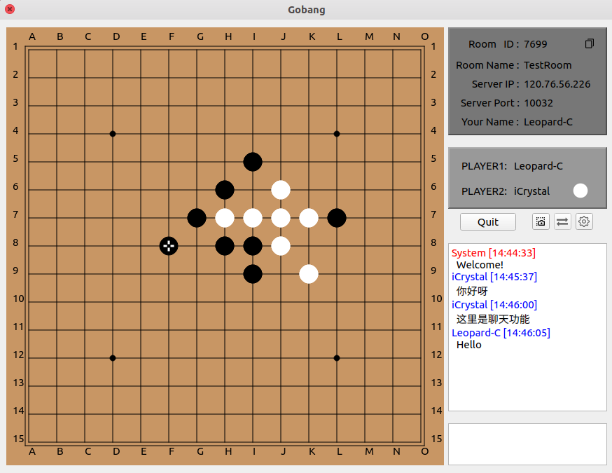
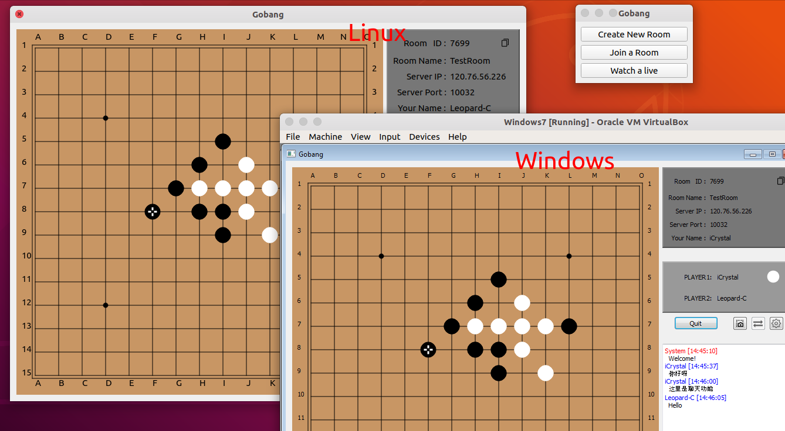
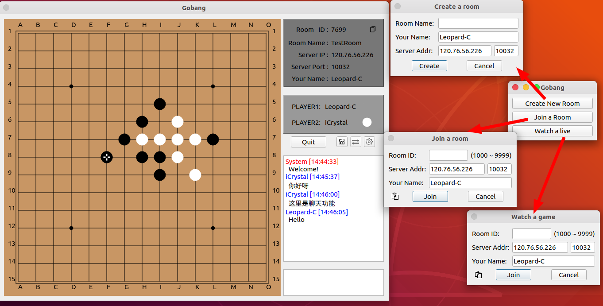
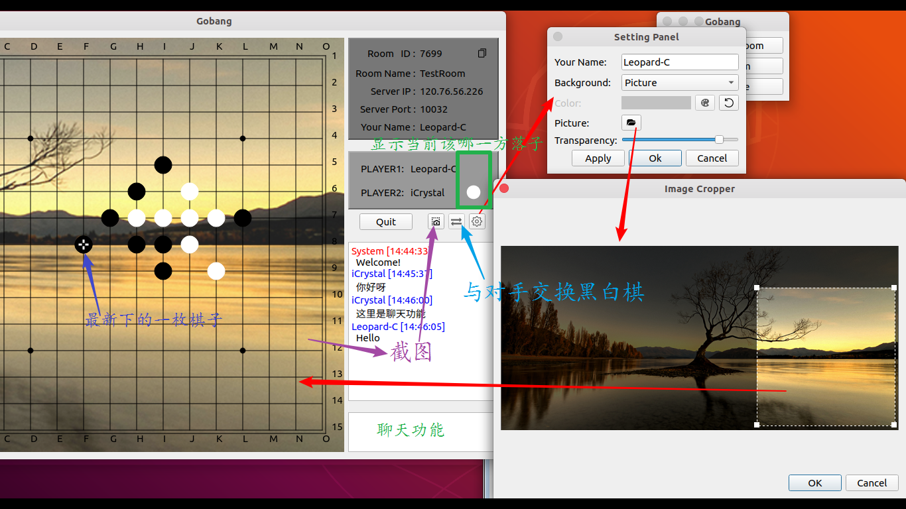

五子棋游戏，游戏双方联网对战。（服务器+客户端）

## 简介

+ Gobang：客户端，使用Qt Creator编写和构建。
+ GobangServer：服务端，使用xmake构建（就是一般的C++代码，可自行更换其他方式）。
+ 客户端和服务端均可以直接在`Linux`和`Windows`平台下构建。

## 功能

+ 联网下棋
+ 人机对战【暂不支持，后续可能会开发......】
+ 观看他人下棋（指定房间号）
+ 简单的聊天功能
+ 其他：交换黑白棋、更换棋盘背景、截图

## 截图

## END

<leopard.c@outlook.com>
